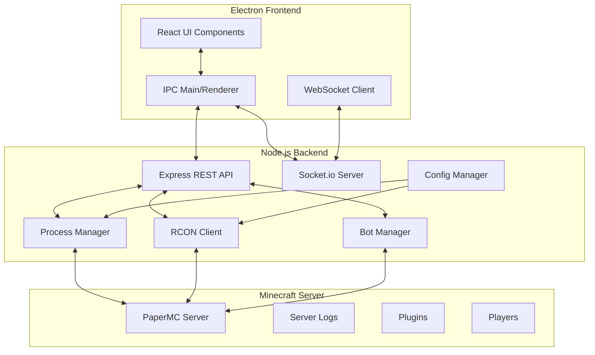

# Minecraft Server Admin - Architecture Overview

## Technology Stack

### Frontend
- **Electron**: Cross-platform desktop app framework
- **React**: UI framework with TypeScript
- **Tailwind CSS**: Utility-first styling
- **Chart.js**: Real-time monitoring graphs
- **Matter.js**: Physics animations for dashboard

### Backend
- **Node.js**: Server-side JavaScript runtime
- **Express**: REST API framework
- **Socket.io**: Real-time WebSocket communication
- **RCON**: Minecraft server remote control protocol
- **Mineflayer**: Minecraft bot framework

### Process Management
- **Child Process**: Node.js native process spawning
- **PM2**: Optional process manager for production

## Architecture Diagram



## Core Modules

### 1. Server Lifecycle Manager
- Start/stop/restart PaperMC server
- Java version detection and validation
- Server properties management
- Startup progress monitoring

### 2. Console Log Manager
- Real-time log streaming
- Color-coded log levels
- Search and filtering capabilities
- Log persistence and rotation

### 3. Player Management
- Live player list with status
- Kick/ban/teleport commands
- Inventory viewing
- Player statistics tracking

### 4. Bot Management System
- Mineflayer bot spawning
- Role-based bot behaviors
- Auto-reconnection logic
- Bot performance monitoring

### 5. Plugin Manager
- Plugin detection and listing
- Enable/disable functionality
- Configuration editing
- Update checking

### 6. Monitoring Dashboard
- Real-time TPS monitoring
- CPU/RAM usage graphs
- Network statistics
- World performance metrics

## Data Flow

1. **User Actions** → Electron IPC → Node.js API
2. **Server Commands** → RCON → Minecraft Server
3. **Real-time Data** → WebSocket → Frontend Updates
4. **Bot Commands** → Mineflayer → Minecraft Server
5. **Logs** → Stream → Frontend Console

## Security Considerations

- Input validation for all commands
- RCON connection encryption
- File system access restrictions
- Process isolation
- Config file encryption

## File Structure
```
src/
├── main/           # Electron main process
├── renderer/       # React frontend
├── backend/        # Node.js backend
├── bots/          # Bot behavior scripts
├── config/        # Configuration files
└── resources/     # Assets and binaries
```