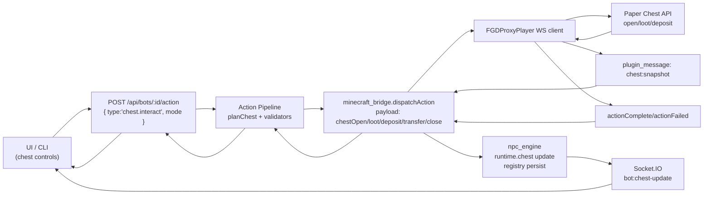

# Chest Interaction Pipeline (UAF Aligned)

Flow (Golden Path)


Supported modes
- `open`  pathfind to chest, open container, emit snapshot
- `loot`  move matching items into bot inventory, emit snapshot
- `deposit`  move matching inventory items into chest, emit snapshot
- `transfer`  chest slot to slot (same container)
- `close`  close container and clear session

Wire-up summary
- Planner: `src/services/action_pipeline/planners/chest.js`
- Bridge payloads: `chestOpen|chestLoot|chestDeposit|chestTransfer|chestClose`
- Plugin: `ActionManager.chest*` + `FGDWebSocketClient` action handler emits `chest:snapshot`
- Bridge events: `plugin_chest_snapshot` -> `chest_snapshot` -> `bot:chest-update`
- Registry/runtime: `npc_engine` stores `runtime.chest` and persists
- UI: Chest Interaction card + live grid (bot:chest-update)

REST examples
```bash
curl -X POST http://localhost:3000/api/bots/miner_01/action \
  -H "X-API-Key: $API_KEY" \
  -H "Content-Type: application/json" \
  -d '{ "type":"chest.interact", "mode":"open", "chestPos":{"x":100,"y":64,"z":-30} }'

curl -X POST http://localhost:3000/api/bots/miner_01/action \
  -H "X-API-Key: $API_KEY" \
  -H "Content-Type: application/json" \
  -d '{ "type":"chest.interact", "mode":"loot", "chestPos":{"x":100,"y":64,"z":-30}, "items":["minecraft:iron_ore","coal"] }'
```
