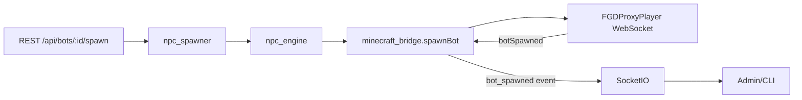

# Minecraft Bridge & Plugin Contract

## Explicit Spawn Contract
- Bridge API: `minecraftBridge.spawnBot({ botId, position, skin, metadata })`
- Plugin WebSocket message:
```json
{
  "action": "spawnBot",
  "botId": "miner_01",
  "position": { "x": 100, "y": 64, "z": -50 },
  "skin": "default",
  "metadata": { "npcType": "miner" }
}
```
- Confirmation (plugin -> bridge):
```json
{
  "type": "botSpawned",
  "botId": "miner_01",
  "position": { "x": 100, "y": 64, "z": -50 },
  "uuid": "minecraft-entity-uuid"
}
```
- Bridge updates bot runtime (position/uuid), resolves pending spawns, and emits `bot_spawned` events.

## Unified Action Contract
- Bridge API: `minecraftBridge.dispatchAction({ action, botId, target, pos, metadata })`
- Plugin WebSocket message:
```json
{
  "type": "action",
  "action": "mine",
  "botId": "miner_01",
  "target": "minecraft:iron_ore",
  "pos": { "x": 100, "y": 64, "z": -50 }
}

// Eating
{
  "type": "action",
  "action": "eat",
  "botId": "miner_01",
  "food": { "itemId": "minecraft:bread", "slot": 12 }
}
```
- Confirmation (plugin -> bridge):
```json
{
  "type": "actionComplete",
  "action": "mine",
  "botId": "miner_01"
}

// Eat confirmation with hunger
{
  "type": "actionComplete",
  "action": "eat",
  "botId": "miner_01",
  "hunger": 18
}

// On failure
{
  "type": "actionFailed",
  "action": "mine",
  "botId": "miner_01",
  "error": "tool_broke or unreachable"
}
```
- Bridge resolves pending actions, updates runtime lastAction, and emits `bot_action_complete` / `bot:actionComplete` Socket.IO.

## Heartbeat & Health
- `pluginHeartbeatAgeSeconds` tracked in `minecraft_bridge.js`.
- `pluginStatus`: `ok` if age <= threshold (default 30s), else `error`.
- `/api/minecraft/status` returns `{ lastHeartbeat, ageSeconds, plugin, rconConnected, pluginConnected }`.
- When plugin unhealthy, bridge emits `plugin_unhealthy`; spawns can be blocked via `blockSpawnsOnPluginError` (default true).

## Spawn Flow
1. REST `POST /api/bots/:id/spawn` -> npc_spawner -> `minecraftBridge.spawnBot`.
2. Bridge sends `spawnBot` to plugin (or RCON fallback).
3. Plugin sends `botSpawned` confirmation with uuid/position.
4. Bridge resolves pending spawn, updates runtime, emits `bot_spawned`.
5. Socket.IO broadcasts `bot:spawned` (via listeners) to UI/CLI for “Confirmed in world”.

## WebSocket Bridging
- Plugin registers via `plugin_register`.
- Heartbeats via `plugin_heartbeat` reset `pluginStatus` to `ok`.
- Spawn confirmations via `plugin_message` with `type: botSpawned`.

## Mermaid

