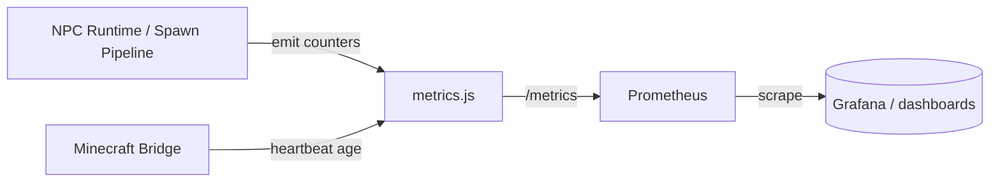

Telemetry & Metrics
===================

Prometheus endpoint
-------------------
- `GET /metrics` (Prometheus text format)

New metrics
-----------
- `fgd_bot_spawns_total` – counter; successful spawns (REST Golden Path).
- `fgd_bot_spawn_failures_total` – counter; failed spawns (validation/bridge errors).
- `fgd_minecraft_plugin_heartbeat_age_seconds` – gauge; plugin heartbeat age tracked by bridge.
- Per-bot labels: both spawn counters also emit `botId`-labeled series (e.g. `fgd_bot_spawns_total{botId="miner_01"}`) for focused dashboards.
- `fgd_action_total{action,bot}` – counter; successful actions dispatched through UAF.
- `fgd_action_failures_total{action,bot}` – counter; failed actions through UAF.
- Existing: `fgd_bridge_heartbeat_age_seconds`, `fgd_task_queue_depth`, `fgd_task_latency_seconds` histogram.

Where they update
-----------------
- `src/services/spawn_pipeline.js` increments success/failure for single and spawn-all calls.
- `minecraft_bridge.recordHeartbeat` updates plugin heartbeat gauges.
- Queue/latency metrics wired in `bindMetricsToNpcEngine`.

Manual checks
-------------
1) Call `POST /api/bots/:id/spawn` then hit `/metrics`; `fgd_bot_spawns_total` should increase by 1.
2) Force a bad position (invalid Y) to get HTTP 400; `fgd_bot_spawn_failures_total` increments.
3) Stop plugin heartbeats; watch `fgd_minecraft_plugin_heartbeat_age_seconds` climb.

Mermaid: telemetry flow
-----------------------

