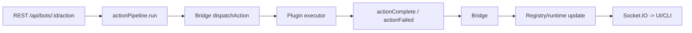

# Unified Action Framework (UAF)

This document mirrors `README_UNIFIED_ACTION_FRAMEWORK.md` and summarizes the live Action pipeline.

## Flow
`REST/CLI/UI -> actionPipeline -> minecraft_bridge.dispatchAction -> plugin -> actionComplete/actionFailed -> registry/runtime -> Socket.IO -> UI`

### Endpoint
- `POST /api/bots/:id/action` body: `{ type, block?, position? }`

### Socket events
- `bot:actionDispatched`
- `bot:actionComplete`
- `bot:actionFailed`

### Metrics
- `fgd_action_total{action,bot}`
- `fgd_action_failures_total{action,bot}`

### Mermaid

