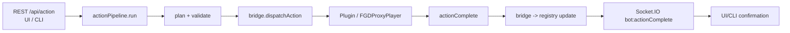

# Unified Action Framework (UAF)

Purpose
-------
Provide one Golden Path for ALL in-world actions across REST, UI, CLI, and plugin:
`REST/UI/CLI -> actionPipeline -> bridge.dispatchAction -> plugin -> confirmation -> registry -> Socket.IO`.

Key endpoints
-------------
- `POST /api/action` – body: `{ botId, type, ... }` e.g. `{ botId: "miner_01", type: "mine", block: "minecraft:iron_ore", position: { x,y,z } }`

Pipeline (code)
---------------
- `src/services/action_pipeline/index.js` – orchestrates validate → plan → dispatch → confirm.
- Validators: `src/services/action_pipeline/validators.js`
- Planners: `src/services/action_pipeline/planners/*`
- Dispatcher: `src/services/action_pipeline/dispatchers.js` → `minecraft_bridge.dispatchAction`
- Bridge dispatch/confirm: `minecraft_bridge.js` (`dispatchAction`, `_onPluginActionComplete`)
- Plugin WS handler: `src/websocket/plugin.js` forwards `actionComplete` to bridge.
- Socket events: `bot:actionDispatched`, `bot:actionComplete`, `bot:actionFailed`

Metrics
-------
- `fgd_action_total{action,bot}` – successful actions
- `fgd_action_failures_total{action,bot}` – failed actions
- Spawn/heartbeat metrics remain unchanged.

CLI
---
- `scripts/fgdctl.js`: `fgdctl action <type> --bot <id> [--block iron_ore] [--pos x y z]`

How to test (curl)
------------------
- Spawn bot: `curl -X POST -H "X-API-Key: $KEY" http://localhost:3000/api/bots/miner_01/spawn`
- Mine: `curl -X POST -H "X-API-Key: $KEY" -H "Content-Type: application/json" -d '{"type":"mine","block":"minecraft:iron_ore","position":{"x":10,"y":64,"z":-5}}' http://localhost:3000/api/bots/miner_01/action`
- Dig: `curl -X POST -H "X-API-Key: $KEY" -H "Content-Type: application/json" -d '{"type":"dig","block":"minecraft:dirt","position":{"x":5,"y":63,"z":0}}' http://localhost:3000/api/bots/miner_01/action`

Mermaid (action pipeline)
-------------------------

